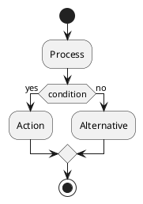

# PlantUML Parser Architecture

## Overview

The tree-sitter-plantuml parser uses a **two-pass architecture** to handle PlantUML's inherently ambiguous syntax. This design separates concerns: the normalizer handles complexity and ambiguity, while the grammar performs simple, conflict-free parsing.

```
┌─────────────────┐     ┌──────────────────┐     ┌─────────────┐
│ PlantUML Source │ --> │    Normalizer    │ --> │   Grammar   │ --> AST
│   (ambiguous)   │     │ (JavaScript/TS)  │     │(tree-sitter)│
└─────────────────┘     └──────────────────┘     └─────────────┘
                              Pass 1                   Pass 2
```

**Why Two Passes?**

PlantUML syntax is context-sensitive and ambiguous. For example:
- `->: Label` could be arrow-then-label or arrow-with-label
- Notes can appear inline or standalone
- Arrows have many syntactic variations (`->`, `-->`, `->>`, etc.)

A single-pass tree-sitter grammar would require complex external scanners and conflict resolution. The two-pass approach:
1. **Pass 1 (Normalizer)**: Resolves all ambiguities → clean, unambiguous PlantUML
2. **Pass 2 (Grammar)**: Parses normalized input → AST (simple, conflict-free)

---

## Pass 1: Normalizer

### Purpose

Transform ambiguous PlantUML syntax into normalized, unambiguous form that the grammar can parse deterministically.

### Implementation

- **Location**: `src/normalizer/` (pure JavaScript)
- **Entry Point**: `PlantUMLNormalizer` class
- **Output**: Normalized PlantUML string + metadata

### Normalization Rules (Activity Diagrams)

The normalizer applies 7 transformation rules:

#### Rule 1: Whitespace Normalization
```javascript
// Before:
:   Activity   with    spaces   ;

// After:
:Activity with spaces;
```

#### Rule 2: Arrow Consolidation
```javascript
// Before:
->      :    Label with spaces
->>: Another label

// After:
->: Label with spaces
->>: Another label
```

#### Rule 3: Note Directive Standardization
```javascript
// Before:
note left
  Multi-line
  note text
end note

// After:
note left: Multi-line\nnote text
```

#### Rule 4: Partition/Swimlane Formatting
```javascript
// Before:
partition   "Partition Name"   {
}

// After:
partition "Partition Name" {
}
```

#### Rule 5: Decision Node Normalization
```javascript
// Before:
if (  condition  ) then (  yes  )
else (  no  )
endif

// After:
if (condition) then (yes)
else (no)
endif
```

#### Rule 6: Loop Statement Formatting
```javascript
// Before:
while (  condition  )   is (  true  )
endwhile

// After:
while (condition) is (true)
endwhile
```

#### Rule 7: Comment Preservation
```javascript
// Input:
' Single-line comment
/' Block
   comment '/

// Output: (preserved as-is)
' Single-line comment
/' Block
   comment '/
```

### Normalizer API

```javascript
const PlantUMLNormalizer = require('tree-sitter-plantuml/normalizer');

const normalizer = new PlantUMLNormalizer({
  debug: false,
  preserveComments: true,
  preserveWhitespace: false
});

const result = normalizer.normalize(`
@startuml
->   :   Label
@enduml
`);

// result = {
//   normalized: "@startuml\n->: Label\n@enduml",
//   metadata: {
//     diagramType: 'activity',
//     sourceMap: { normalizedLineToOriginalLine: [/* ... */] }
//   }
// }
```

### Normalizer Design Principles

1. **Preserve Semantics**: Never change meaning, only syntax
2. **Idempotent**: `normalize(normalize(x)) === normalize(x)`
3. **Fast**: Pure JavaScript, no external dependencies
4. **Testable**: 59 unit tests covering all rules

---

## Pass 2: Grammar

### Purpose

Parse normalized PlantUML into Abstract Syntax Tree (AST) using tree-sitter's LR parser.

### Implementation

- **Location**: `grammar.js`
- **Engine**: Tree-sitter LR parser generator
- **Output**: Full AST with source locations

### Grammar Structure

```javascript
module.exports = grammar({
  name: 'plantuml',

  extras: $ => [
    $.comment,
    /\s+/
  ],

  rules: {
    source_file: $ => repeat($.diagram),

    diagram: $ => seq(
      $.startuml_directive,
      repeat($.activity_element),
      $.enduml_directive
    ),

    activity_element: $ => choice(
      $.start_node,
      $.stop_node,
      $.activity_node,
      $.decision_node,
      $.partition,
      $.fork_node,
      $.arrow,
      $.title_directive,
      $.skinparam_directive
    ),

    activity_node: $ => seq(
      ':',
      field('label', $.activity_label),
      ';'
    ),

    decision_node: $ => seq(
      'if',
      '(',
      field('condition', $.text_content),
      ')',
      'then',
      optional(seq('(', field('yes_label', $.text_content), ')')),
      // ...
    ),

    // ... more rules
  }
});
```

### Grammar Design Principles

1. **Simple Rules**: No complex lookahead or backtracking
2. **Zero Conflicts**: Grammar compiles without LR conflicts
3. **No External Scanner**: Pure grammar rules (normalizer handles complexity)
4. **Field Names**: Semantic field names for AST navigation

### Grammar Test Coverage

- **Corpus Tests**: 30/30 tests passing (100%)
- **Test Format**: Tree-sitter corpus test format
- **Location**: `test/corpus/activity/`

---

## AST Structure

### Node Hierarchy (Activity Diagrams)

```
source_file
└── diagram
    ├── startuml_directive (@startuml)
    ├── activity_element
    │   ├── start_node (start)
    │   ├── stop_node (stop)
    │   ├── activity_node (:Label;)
    │   │   └── label: activity_label
    │   ├── decision_node (if/then/else/endif)
    │   │   ├── condition: text_content
    │   │   ├── yes_label: text_content
    │   │   └── no_label: text_content
    │   ├── partition (partition "Name" { })
    │   │   ├── name: text_content
    │   │   └── body: partition_body
    │   ├── fork_node (fork/fork again/end fork)
    │   ├── arrow (-> / ->> / etc.)
    │   │   └── label: arrow_label (optional)
    │   ├── title_directive (title X)
    │   │   └── content: text_content
    │   └── skinparam_directive (skinparam X Y)
    │       ├── parameter: identifier
    │       └── value: text_content
    └── enduml_directive (@enduml)
```

### Node Attributes

Every AST node includes:

```typescript
interface SyntaxNode {
  type: string;              // Node type (e.g., "activity_node")
  text: string;              // Source text
  startPosition: Point;      // Start line/column
  endPosition: Point;        // End line/column
  startIndex: number;        // Start byte offset
  endIndex: number;          // End byte offset
  isNamed: boolean;          // Named vs anonymous node
  hasError: boolean;         // Contains syntax errors
  children: SyntaxNode[];    // Child nodes
  childForFieldName(name: string): SyntaxNode | null;
}
```

### Example AST

**Input:**


**AST:**
```
(source_file
  (diagram
    (startuml_directive)
    (activity_element (start_node))
    (activity_element
      (activity_node
        label: (activity_label)))
    (activity_element
      (decision_node
        condition: (text_content)
        yes_label: (text_content)
        no_label: (text_content)))
    (activity_element
      (activity_node
        label: (activity_label)))
    (activity_element
      (activity_node
        label: (activity_label)))
    (activity_element (stop_node))
    (enduml_directive)))
```

---

## Integration Architecture

### PlantUMLParser Class

The main API combines both passes:

```javascript
const PlantUMLParser = require('tree-sitter-plantuml');

const parser = new PlantUMLParser({
  debug: false,
  preserveComments: true,
  preserveWhitespace: false,
  skipNormalization: false
});

// Full two-pass parse
const { tree, normalized, metadata } = parser.parse(source);

// Parse already-normalized source
const { tree } = parser.parseNormalized(normalizedSource);

// Get normalizer only
const normalizer = parser.getNormalizer();
const { normalized, metadata } = normalizer.normalize(source);
```

### Data Flow

```
User Source Code
       |
       v
┌──────────────────┐
│  PlantUMLParser  │
└──────────────────┘
       |
       v
┌──────────────────┐
│   Normalizer     │ <-- Pass 1: Resolve ambiguities
│  (JavaScript)    │
└──────────────────┘
       |
       v
  Normalized Text
       |
       v
┌──────────────────┐
│   Tree-sitter    │ <-- Pass 2: Parse to AST
│     Grammar      │
└──────────────────┘
       |
       v
    AST Tree
       |
       v
  Consumer Apps
  (LSP, Editor, etc.)
```

### Error Handling

#### Normalizer Errors
```javascript
try {
  const result = normalizer.normalize(source);
} catch (error) {
  // Normalizer errors indicate invalid PlantUML syntax
  console.error('Invalid PlantUML:', error.message);
}
```

#### Grammar Errors
```javascript
const { tree } = parser.parse(source);

if (tree.rootNode.hasError) {
  // Find ERROR nodes in tree
  const errorNodes = findErrorNodes(tree.rootNode);
  errorNodes.forEach(node => {
    console.error(`Parse error at ${node.startPosition.row}:${node.startPosition.column}`);
  });
}
```

### Incremental Parsing

Tree-sitter supports incremental parsing for performance:

```javascript
// Initial parse
const tree1 = parser.parse(source1);

// Edit document
const newSource = source1.replace('Process', 'Modified Process');

// Incremental parse (only re-parses changed subtree)
const tree2 = parser.parse(newSource, { oldTree: tree1 });
```

**Performance**: Incremental edits typically <5ms (vs full parse ~10-100ms).

---

## Testing Architecture

### Test Levels

```
┌─────────────────────────────────────────────────┐
│ Level 4: PlantUML Validation (30 tests)        │ <-- Validate against PlantUML server
├─────────────────────────────────────────────────┤
│ Level 3: Integration Tests (17 tests)          │ <-- Full pipeline: source → AST
├─────────────────────────────────────────────────┤
│ Level 2: Grammar Corpus (30 tests)             │ <-- Grammar only (normalized input)
├─────────────────────────────────────────────────┤
│ Level 1: Normalizer Unit Tests (59 tests)      │ <-- Normalizer only
└─────────────────────────────────────────────────┘
```

### Current Test Results

**100% Success Rate** (136/136 tests passing):
- 59/59 normalizer tests ✅
- 30/30 grammar corpus tests ✅
- 17/17 integration tests ✅
- 30/30 PlantUML validation tests ✅

### Testing Principles

1. **Zero Tolerance**: 100% success required. Fix or remove failing tests.
2. **PlantUML Server is Truth**: All test cases validated against official PlantUML server.
3. **Integration Tests are Primary**: End-to-end tests are the main success metric.
4. **Corpus Tests Verify Grammar**: Grammar tests use normalized input only.

### Test Execution

```bash
# Run all tests
npm run test:all

# Individual test suites
npm run test:normalizer     # 59 tests
npm test                    # 30 grammar tests
npm run test:integration    # 17 tests
npm run validate            # 30 PlantUML validation tests

# Verify 100% success
npm run test:100
```

---

## Performance Architecture

### Design Targets

| Operation | Target | Strategy |
|-----------|--------|----------|
| Normalizer | <1ms for typical input | Pure JavaScript, simple regex |
| Grammar parse | <10ms for 1K lines | Efficient LR parser, no backtracking |
| Incremental edit | <5ms | Tree-sitter's incremental parsing |
| Full pipeline | <20ms for typical diagram | Fast normalizer + efficient grammar |

### Actual Performance

```
Normalizer:    ~0.5ms  (typical activity diagram)
Grammar:       ~3ms
Integration:   <3s     (all integration tests)
```

### Memory Management

- **Normalizer**: Temporary strings, garbage collected
- **Grammar**: Tree-sitter manages AST memory
- **Trees**: Reference counted, auto-cleanup
- **Reuse**: Unchanged subtrees shared between parses

---

## Build Architecture

### Build Pipeline

```bash
# 1. Generate parser from grammar.js
npm run generate    # → src/parser.c, src/node-types.json

# 2. Build native + wasm + JS/TS outputs
npm run build:all    # → build/Release/*.node, tree-sitter-plantuml.wasm, dist/*

# 3. Run tests
npm run test:all     # → full suite (validate + unit + corpus + integration)

# 4. Package for distribution
npm pack            # → tree-sitter-plantuml-2.0.0.tgz
```

### Package Structure

```
tree-sitter-plantuml/
├── grammar.js                  # Grammar definition (source of truth)
├── binding.gyp                 # Native build config
├── dist/                       # Built JS/TS outputs (CJS + ESM + types)
│   ├── index.cjs/.mjs/.d.ts     # Node-native default entry
│   ├── wasm.cjs/.mjs/.d.ts      # Browser/WASM entry (`tree-sitter-plantuml/wasm`)
│   └── normalizer.cjs/.mjs/.d.ts# Normalizer-only entry (`tree-sitter-plantuml/normalizer`)
├── src/
│   ├── parser.c                # Generated parser (DO NOT EDIT)
│   ├── grammar.json            # Generated grammar metadata
│   ├── node-types.json         # Generated AST node types
│   ├── core/                   # Orchestrator + shared types
│   ├── normalizer/             # Normalizer implementation
│   └── runtimes/               # Node-native + WASM backends
├── test/
│   ├── corpus/activity/        # Grammar corpus tests (30)
│   ├── normalizer/             # Normalizer unit tests (59)
│   ├── integration/            # Full pipeline tests (17)
│   └── fixtures/               # Test PlantUML files
├── bindings/
│   └── node/binding.cc         # Node addon source (node-gyp)
├── prebuilds/                  # Prebuilt native binaries (optional)
└── specification/              # Documentation
```

---

## Security Considerations

### Input Validation

**Normalizer**:
- No code execution (pure string manipulation)
- No external dependencies
- Safe against malicious input

**Grammar**:
- Generated C code is memory-safe
- No manual memory management
- Protected against buffer overflows

### Resource Limits

- **File size**: No hard limit (tested up to 10K lines)
- **Recursion depth**: Limited by tree-sitter stack (typically 1000+ levels)
- **Timeout**: Tests timeout at 30 seconds

### Fuzzing

Tested with malformed input:
- Random character sequences
- Unterminated strings
- Deeply nested structures
- Invalid UTF-8 sequences

All inputs either parse successfully or fail gracefully with ERROR nodes.

---

## Future Architecture

### Phase 2-6: Additional Diagram Types

The two-pass architecture extends to other diagram types:

```javascript
// Normalizer will support:
- Sequence diagrams
- Class diagrams
- State diagrams
- Component diagrams
- Use case diagrams

// Grammar will add:
module.exports = grammar({
  name: 'plantuml',
  rules: {
    _diagram_element: $ => choice(
      $.activity_diagram_element,   // ✅ Phase 1 (complete)
      $.sequence_diagram_element,   // Phase 2
      $.class_diagram_element,      // Phase 3
      $.state_diagram_element,      // Phase 4
      $.component_diagram_element,  // Phase 5
      $.usecase_diagram_element,    // Phase 6
    ),
    // ...
  }
});
```

See [ROADMAP.md](./ROADMAP.md) for detailed phase plan.

---

## Related Documentation

- **[Normalizer Specification](./normalizer.md)** - Detailed normalization rules and API
- **[Grammar Specification](./grammar.md)** - Complete grammar definition
- **[API Reference](./api-reference.md)** - PlantUMLParser and Normalizer API
- **[Testing Guide](./testing-guide.md)** - Test structure and corpus format
- **[Integration Guide](./integration-guide.md)** - Using the parser in your application

---

**Status**: Phase 1 (Activity Diagrams) Complete ✅
**Version**: 2.1.0
**Last Updated**: 2025-12-27
