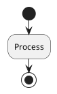
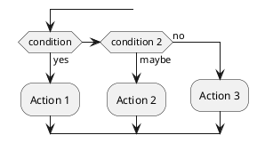
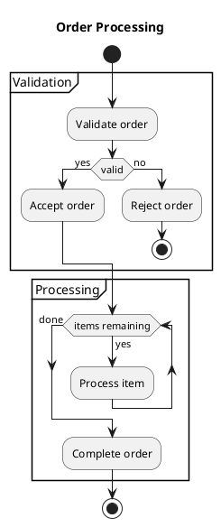

# Grammar Specification

## Overview

This document defines the tree-sitter grammar for the PlantUML parser. The grammar is **Pass 2** of the two-pass architecture and expects **normalized PlantUML input** from the normalizer.

**Key Principle**: The grammar is simple and conflict-free because the normalizer (Pass 1) has already resolved all ambiguities.

## Grammar Design Principles

### 1. No External Scanner
All parsing is done through grammar rules. No custom C scanner needed.

### 2. Conflict-Free
Zero LR conflicts. Normalized input is unambiguous.

### 3. Normalized Input Only
Grammar expects clean, normalized PlantUML text. All edge cases handled by normalizer.

### 4. Diagram-Type Modularity
Each diagram type has self-contained rules (currently: Activity Diagrams only).

### 5. Lossless Parsing
All source information preserved, including whitespace and comments.

---

## Current Implementation

**Phase 1: Activity Diagrams** ✅ **Complete**

Supported elements:
- Start/Stop nodes
- Activity nodes (`:Label;`)
- Flow arrows (`->`, `-->`, `->>`, etc.)
- Decision nodes (`if/then/else/endif`)
- Loops (`while/endwhile`, `repeat/repeat while`)
- Partitions and swimlanes
- Fork/split nodes
- Directives (title, skinparam)
- Comments (line and block)

---

## Grammar Structure

### Document Root

```javascript
source_file: $ => repeat($._element),

_element: $ => choice(
  $.diagram,
  $.line_comment,
  $.block_comment
),
```

### Diagram Structure

```javascript
diagram: $ => seq(
  $.startuml_directive,    // @startuml
  repeat($._statement),    // Diagram elements
  $.enduml_directive       // @enduml
),

startuml_directive: $ => /@startuml(?:[ \t]+[^\n]*)?/,
enduml_directive: $ => /@enduml/,
```

### Activity Elements

```javascript
_statement: $ => choice(
  $.activity_element
),

activity_element: $ => choice(
  $.start_node,
  $.stop_node,
  $.activity_node,
  $.flow_arrow,
  $.decision_node,
  $.while_loop,
  $.repeat_loop,
  $.partition,
  $.swimlane,
  $.fork_node,
  $.join_node,
  $.split_node,
  $.split_join_node,
  $.title_directive,
  $.note_directive,
  $.skinparam_directive,
  $.detach,
  $.kill
),
```

---

## Activity Diagram Grammar

### Start and Stop Nodes

**Grammar:**
```javascript
start_node: $ => 'start',
stop_node: $ => 'stop',
```

**Example:**


**AST:**
```
(source_file
  (diagram
    (startuml_directive)
    (activity_element (start_node))
    (activity_element (activity_node label: (activity_label)))
    (activity_element (stop_node))
    (enduml_directive)))
```

---

### Activity Nodes

**Grammar:**
```javascript
activity_node: $ => seq(
  ':',
  field('label', $.activity_label),
  ';'
),

activity_label: $ => /[^;\n]+/,
```

**Examples:**
```plantuml
:Simple activity;
:Activity with spaces;
:Multi-line\nActivity;
```

**AST:**
```
(activity_node label: (activity_label))
```

---

### Flow Arrows

**Grammar:**
```javascript
flow_arrow: $ => choice(
  seq(
    field('type', $.arrow_type),
    field('label', alias(token.immediate(/:[^\n;]+/), $.arrow_label))
  ),
  field('type', $.arrow_type)
),

arrow_type: $ => choice(
  '->',   // Solid arrow
  '-->',  // Dashed arrow
  '->>',  // Thin arrow
  '.>',   // Dotted arrow
  '<-',   // Left arrow
  '<--',  // Left dashed
  '<<-',  // Left thin
  '<.'    // Left dotted
),
```

**Examples:**
```plantuml
->
->: With label
-->: Dashed with label
->>: Thin arrow
```

**AST:**
```
(activity_element
  (flow_arrow
    type: (arrow_type)
    label: (arrow_label)))  # if label present
```

---

### Decision Nodes

**Grammar:**
```javascript
decision_node: $ => seq(
  'if',
  field('condition', $.condition),
  'then',
  optional(field('true_label', $.branch_label)),
  repeat($._statement),
  repeat($.elseif_branch),
  optional($.else_branch),
  'endif'
),

elseif_branch: $ => seq(
  'elseif',
  field('condition', $.condition),
  'then',
  optional(field('label', $.branch_label)),
  repeat($._statement)
),

else_branch: $ => seq(
  'else',
  optional(field('label', $.branch_label)),
  repeat($._statement)
),

condition: $ => seq('(', /[^)]+/, ')'),
branch_label: $ => seq('(', /[^)]+/, ')'),
```

**Example:**


**AST:**
```
(decision_node
  condition: (condition)
  true_label: (branch_label)
  (activity_element (activity_node ...))
  (elseif_branch
    condition: (condition)
    label: (branch_label)
    (activity_element (activity_node ...)))
  (else_branch
    label: (branch_label)
    (activity_element (activity_node ...))))
```

---

### Loops

**While Loop:**
```javascript
while_loop: $ => seq(
  'while',
  field('condition', $.condition),
  optional(seq('is', field('label', $.branch_label))),
  repeat($._statement),
  'endwhile',
  optional(field('end_label', $.branch_label))
),
```

**Example:**
```plantuml
while (not done) is (continue)
  :Process item;
endwhile (done)
```

**AST:**
```
(while_loop
  condition: (condition)
  label: (branch_label)
  (activity_element (activity_node ...))
  end_label: (branch_label))
```

**Repeat Loop:**
```javascript
repeat_loop: $ => prec.right(seq(
  'repeat',
  repeat1($._statement),
  'repeat',
  'while',
  field('condition', $.condition),
  optional(seq('is', field('label', $.branch_label)))
)),
```

**Example:**
```plantuml
repeat
  :Process;
repeat while (condition) is (true)
```

**AST:**
```
(repeat_loop
  (activity_element (activity_node ...))
  condition: (condition)
  label: (branch_label))
```

---

### Partitions and Swimlanes

**Partition:**
```javascript
partition: $ => prec.right(choice(
  // Partition with braces
  seq(
    'partition',
    field('name', $.string),
    optional(field('color', $.color)),
    '{',
    repeat($._statement),
    '}'
  ),
  // Partition without braces (inline)
  seq(
    'partition',
    field('name', $.string),
    optional(field('color', $.color))
  )
)),

string: $ => seq('"', /[^"]*/, '"'),
color: $ => seq('#', /[a-zA-Z0-9]+/),
```

**Example:**
```plantuml
partition "Module A" #lightblue {
  :Task 1;
  :Task 2;
}
```

**AST:**
```
(partition
  name: (string)
  color: (color)
  (activity_element (activity_node ...))
  (activity_element (activity_node ...)))
```

**Swimlane:**
```javascript
swimlane: $ => seq(
  '|',
  field('name', $.swimlane_name),
  '|'
),

swimlane_name: $ => /[^|]+/,
```

**Example:**
```plantuml
|Frontend|
:Render UI;
|Backend|
:Process data;
```

**AST:**
```
(swimlane name: (swimlane_name))
```

---

### Fork and Split Nodes

**Grammar:**
```javascript
fork_node: $ => choice(
  token(seq('fork', /\s+/, 'again')),
  'fork'
),

join_node: $ => seq('end', 'fork'),

split_node: $ => choice(
  token(seq('split', /\s+/, 'again')),
  'split'
),

split_join_node: $ => seq('end', 'split'),
```

**Example:**
```plantuml
fork
  :Task A;
fork again
  :Task B;
end fork
```

**AST:**
```
(fork_node)
(activity_element (activity_node ...))
(fork_node)
(activity_element (activity_node ...))
(join_node)
```

---

### Directives

**Title Directive:**
```javascript
title_directive: $ => seq(
  'title',
  field('content', $.text_content)
),

text_content: $ => /[^\n]+/,
```

**Example:**
```plantuml
title My Activity Diagram
```

**AST:**
```
(title_directive content: (text_content))
```

**Skinparam Directive:**
```javascript
skinparam_directive: $ => seq(
  'skinparam',
  field('parameter', $.identifier),
  field('value', $.text_content)
),

identifier: $ => /[a-zA-Z_][a-zA-Z0-9_]*/,
```

**Example:**
```plantuml
skinparam backgroundColor LightYellow
```

**AST:**
```
(skinparam_directive
  parameter: (identifier)
  value: (text_content))
```

**Note Directive:**
```javascript
note_directive: $ => choice(
  // Multi-line note
  seq(
    'note',
    field('position', $.note_position),
    repeat1($.note_line),
    'end',
    'note'
  ),
  // Single line note: note position: content
  seq(
    'note',
    field('position', $.note_position),
    ':',
    field('content', $.text_content)
  )
),

note_position: $ => choice('left', 'right', 'top', 'bottom'),
note_line: $ => /[^\n]+/,
```

**Example:**
```plantuml
note left: This is a note
```

---

### Special Nodes

**Grammar:**
```javascript
detach: $ => 'detach',
kill: $ => 'kill',
```

**Example:**
```plantuml
:Process;
detach
```

---

### Comments

**Grammar:**
```javascript
line_comment: $ => token(seq("'", /.*/)),

block_comment: $ => token(seq(
  "/'",
  repeat(choice(
    /[^']/,
    /'[^/]/
  )),
  "'/"
)),

extras: $ => [
  /\s/,              // Whitespace
  $.line_comment,
  $.block_comment
],
```

**Examples:**
```plantuml
' Single-line comment
:Process;

/' Block comment
   Multiple lines
'/
:Another process;
```

**AST:**
```
Comments are included in extras, preserving them in the tree
but not as explicit nodes in the AST unless needed.
```

---

## Complete Example

### Input (Normalized)


### AST Output
```
(source_file
  (diagram
    (startuml_directive)
    (activity_element
      (title_directive content: (text_content)))
    (activity_element (start_node))
    (activity_element
      (partition
        name: (string)
        (activity_element
          (activity_node label: (activity_label)))
        (activity_element
          (decision_node
            condition: (condition)
            true_label: (branch_label)
            (activity_element
              (activity_node label: (activity_label)))
            (else_branch
              label: (branch_label)
              (activity_element
                (activity_node label: (activity_label)))
              (activity_element (stop_node)))))))
    (activity_element
      (partition
        name: (string)
        (activity_element
          (while_loop
            condition: (condition)
            label: (branch_label)
            (activity_element
              (activity_node label: (activity_label)))
            end_label: (branch_label)))
        (activity_element
          (activity_node label: (activity_label)))))
    (activity_element (stop_node))
    (enduml_directive)))
```

---

## Grammar Testing

### Test Coverage

**30 corpus tests** covering:
- Basic nodes (start, stop, activity)
- Decisions (if/then/else/endif, elseif)
- Loops (while, repeat)
- Partitions and swimlanes
- Forks and splits
- Directives (title, skinparam)
- Real-world examples

### Test Format

Tree-sitter corpus test format in `test/corpus/activity/`:

```
===========================
Test name
===========================
@startuml
input code
@enduml
----------------------------
(expected_ast_structure)
```

### Running Tests

```bash
npm test                # Run all 30 grammar corpus tests
npm run test:all        # Run all test suites (136 tests)
```

**Current Status**: 30/30 tests passing (100% ✅)

---

## Grammar Compilation

### Build Process

```bash
# Generate parser from grammar.js
npm run generate

# This creates:
# - src/parser.c (generated C parser)
# - src/grammar.json (grammar metadata)
# - src/node-types.json (AST node type definitions)
```

### Zero Conflicts

The grammar compiles with **zero LR conflicts** because:
1. Normalizer resolves all ambiguities before parsing
2. Simple, deterministic grammar rules
3. No complex lookahead or backtracking needed

---

## Error Handling

### Error Recovery

Tree-sitter automatically inserts ERROR nodes for invalid syntax:

```plantuml
@startuml
:Valid activity;
invalid syntax here
:Another valid activity;
@enduml
```

**AST:**
```
(source_file
  (diagram
    (startuml_directive)
    (activity_element (activity_node ...))
    (ERROR)  # Invalid syntax wrapped in ERROR node
    (activity_element (activity_node ...))
    (enduml_directive)))
```

### Synchronization Points

Parser recovers at:
- Diagram boundaries (`@startuml`, `@enduml`)
- Activity node boundaries (`:`, `;`)
- Control flow keywords (`if`, `endif`, `while`, `endwhile`)
- Partition/swimlane boundaries

---

## Future Grammar Extensions

### Phase 2-6: Additional Diagram Types

The grammar will be extended to support:

**Phase 2: Sequence Diagrams**
- Participants, messages, activations, groups

**Phase 3: Class Diagrams**
- Classes, interfaces, relationships, packages

**Phase 4: State Diagrams**
- States, transitions, composite states

**Phase 5: Component Diagrams**
- Components, interfaces, ports

**Phase 6: Use Case Diagrams**
- Actors, use cases, system boundaries

See [ROADMAP.md](./ROADMAP.md) for detailed phase plan.

### Grammar Extensibility

The grammar is designed to be extended:

```javascript
_statement: $ => choice(
  $.activity_element,      // ✅ Phase 1 (complete)
  $.sequence_element,      // Phase 2
  $.class_element,         // Phase 3
  $.state_element,         // Phase 4
  $.component_element,     // Phase 5
  $.usecase_element        // Phase 6
),
```

Each diagram type will have modular, self-contained rules.

---

## Related Documentation

- **[Architecture](./architecture.md)** - Two-pass parser design
- **[Normalizer](./normalizer.md)** - Pass 1 normalization rules
- **[Testing Guide](./testing-guide.md)** - Corpus test format
- **[API Reference](./api-reference.md)** - Parser API

---

**Grammar File**: `grammar.js`
**Generated Parser**: `src/parser.c`
**Node Types**: `src/node-types.json`
**Test Corpus**: `test/corpus/activity/`

**Status**: Phase 1 Complete ✅
**Version**: 2.0.0
**Last Updated**: 2025-11-15
