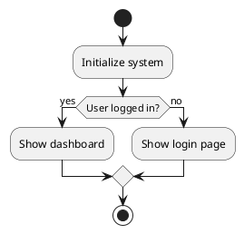
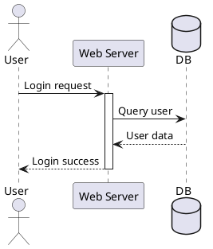
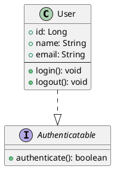
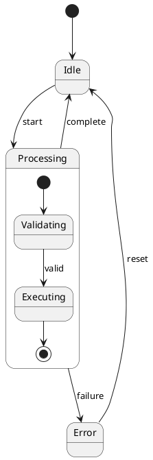

# Grammar Specification

## Overview

This document defines the grammar rules for the tree-sitter-plantuml parser, organized by diagram type. Each section specifies the syntax elements, token patterns, and precedence rules needed to parse PlantUML source code into accurate ASTs.

## Grammar Design Principles

### 1. Diagram-Type Modularity
Each diagram type has self-contained rules that don't interfere with others:

```javascript
_diagram_element: $ => choice(
  $.activity_element,
  $.sequence_element,
  $.class_element,
  // ... diagram-specific choices
  $.common_directive  // Shared directives
)
```

### 2. Error Recovery Points
Use synchronization tokens to recover from syntax errors:

```javascript
diagram: $ => seq(
  $.startuml_directive,
  repeat($._diagram_element),  // Continues despite errors in elements
  $.enduml_directive
)
```

### 3. Lossless Parsing
Include all source information:

```javascript
extras: $ => [
  $.comment,
  /\s+/,  // Whitespace is significant for reconstruction
]
```

### 4. Unambiguous Precedence
Explicitly resolve conflicts:

```javascript
precedences: $ => [
  ['arrow_with_label', 'arrow_without_label'],
  // ...
]
```

## Common Grammar Elements

### Document Structure

```javascript
source_file: $ => repeat($._definition),

_definition: $ => choice(
  $.diagram,
  $.comment,
  $.preprocessor_directive
),

diagram: $ => seq(
  $.startuml_directive,
  optional($.diagram_title),
  repeat($._diagram_element),
  $.enduml_directive
),

startuml_directive: $ => seq(
  '@startuml',
  optional($.identifier)  // Optional diagram name
),

enduml_directive: $ => '@enduml',
```

### Comments

```javascript
comment: $ => choice(
  $.line_comment,
  $.block_comment
),

line_comment: $ => token(seq(
  "'",
  /[^\n]*/
)),

block_comment: $ => token(seq(
  "/'",
  repeat(choice(
    /[^']/,
    /'[^/]/
  )),
  "'/"
)),
```

### Common Directives

```javascript
_common_directive: $ => choice(
  $.title_directive,
  $.note_directive,
  $.style_directive,
  $.skinparam_directive
),

title_directive: $ => seq(
  'title',
  field('content', $.text_line)
),

note_directive: $ => choice(
  $.floating_note,
  $.attached_note
),

floating_note: $ => seq(
  'note',
  field('position', choice('left', 'right', 'top', 'bottom')),
  optional(seq('of', field('target', $.identifier))),
  field('content', $.note_content),
  'end note'
),

note_content: $ => repeat1($.text_line),

skinparam_directive: $ => seq(
  'skinparam',
  field('parameter', $.identifier),
  field('value', choice($.identifier, $.color, $.number))
),
```

### Basic Tokens

```javascript
identifier: $ => /[a-zA-Z_][a-zA-Z0-9_]*/,

quoted_identifier: $ => seq('"', /[^"]+/, '"'),

text_line: $ => /[^\n]+/,

color: $ => token(choice(
  /#[0-9A-Fa-f]{6}/,       // Hex color
  /#[0-9A-Fa-f]{3}/,       // Short hex
  /[a-zA-Z]+/              // Named color
)),

number: $ => /\d+/,

string: $ => choice(
  seq('"', repeat(/[^"\\]|\\./))), '"'),
  seq("'", repeat(/[^'\\]|\\./))), "'")
),
```

## Activity Diagram Grammar

### Overview
Activity diagrams represent workflows with actions, decisions, and control flow.

### Grammar Rules

```javascript
activity_element: $ => choice(
  $.activity_node,
  $.start_node,
  $.stop_node,
  $.decision_node,
  $.fork_node,
  $.join_node,
  $.partition,
  $.swimlane,
  $.flow_arrow,
  $._common_directive
),

// Basic activity node
activity_node: $ => seq(
  ':',
  field('label', $.activity_label),
  ';'
),

activity_label: $ => choice(
  $.text_line,
  $.multiline_text
),

multiline_text: $ => seq(
  $.text_line,
  repeat(seq('\\n', $.text_line))
),

// Start/Stop nodes
start_node: $ => choice(
  'start',
  seq('(*', ')'),
  '(*top)'
),

stop_node: $ => choice(
  'stop',
  'end',
  seq('(', '*', ')'),
  '(*)'
),

// Decision nodes
decision_node: $ => seq(
  'if',
  '(',
  field('condition', $.condition_expression),
  ')',
  optional('is'),
  '(',
  field('true_label', $.text_line),
  ')',
  'then',
  optional(seq('(', field('true_arrow', $.text_line), ')')),
  repeat($.activity_element),
  repeat($.elseif_branch),
  optional($.else_branch),
  'endif'
),

elseif_branch: $ => seq(
  'elseif',
  '(',
  field('condition', $.condition_expression),
  ')',
  optional('is'),
  '(',
  field('label', $.text_line),
  ')',
  'then',
  optional(seq('(', field('arrow', $.text_line), ')')),
  repeat($.activity_element)
),

else_branch: $ => seq(
  'else',
  optional(seq('(', field('label', $.text_line), ')')),
  repeat($.activity_element)
),

condition_expression: $ => /[^)]+/,  // Simplified; could be more detailed

// Parallel processing
fork_node: $ => choice(
  'fork',
  'fork again',
  'split',
  'split again'
),

join_node: $ => choice(
  'end fork',
  'end split'
),

// Partitions and swimlanes
partition: $ => seq(
  'partition',
  field('name', choice($.identifier, $.quoted_identifier)),
  optional($.color_spec),
  '{',
  repeat($.activity_element),
  '}'
),

swimlane: $ => seq(
  '|',
  field('name', $.text_line),
  '|'
),

color_spec: $ => seq('#', $.color),

// Control flow arrows
flow_arrow: $ => seq(
  '->',
  optional(field('label', $.text_line)),
  ';'
),

// Repeat loops
repeat_loop: $ => choice(
  $.repeat_while,
  $.while_loop
),

repeat_while: $ => seq(
  'repeat',
  optional(seq(':', field('label', $.text_line))),
  repeat($.activity_element),
  'repeat while',
  '(',
  field('condition', $.condition_expression),
  ')',
  optional('is'),
  '(',
  field('label', $.text_line),
  ')',
  optional(seq('->', $.backward_arrow))
),

while_loop: $ => seq(
  'while',
  '(',
  field('condition', $.condition_expression),
  ')',
  optional('is'),
  '(',
  field('label', $.text_line),
  ')',
  repeat($.activity_element),
  'endwhile',
  optional(seq('(', field('end_label', $.text_line), ')'))
),

// Detach (interrupt flow)
detach: $ => 'detach',
```

### Example



**Expected AST:**

```
(source_file
  (diagram
    (startuml_directive)
    (start_node)
    (activity_node label: (activity_label))
    (decision_node
      condition: (condition_expression)
      true_label: (text_line)
      (activity_node label: (activity_label))
      (else_branch
        label: (text_line)
        (activity_node label: (activity_label))))
    (stop_node)
    (enduml_directive)))
```

## Sequence Diagram Grammar

### Overview
Sequence diagrams show interactions between participants over time.

### Grammar Rules

```javascript
sequence_element: $ => choice(
  $.participant_declaration,
  $.message,
  $.activation,
  $.group,
  $.divider,
  $.delay,
  $.space,
  $._common_directive
),

// Participant declarations
participant_declaration: $ => seq(
  field('type', $.participant_type),
  field('name', $.identifier),
  optional(seq('as', field('alias', $.identifier))),
  optional($.stereotype),
  optional($.color_spec),
  optional($.order_spec)
),

participant_type: $ => choice(
  'participant',
  'actor',
  'boundary',
  'control',
  'entity',
  'database',
  'collections',
  'queue'
),

stereotype: $ => seq(
  '<<',
  $.identifier,
  '>>'
),

order_spec: $ => seq('order', $.number),

// Messages
message: $ => seq(
  field('sender', $.participant_ref),
  field('arrow', $._message_arrow),
  field('receiver', $.participant_ref),
  optional(seq(':', field('label', $.message_text))),
  optional($.message_number)
),

participant_ref: $ => choice(
  $.identifier,
  $.quoted_identifier
),

_message_arrow: $ => choice(
  $.sync_arrow,
  $.async_arrow,
  $.return_arrow,
  $.creation_arrow,
  $.destruction_arrow
),

sync_arrow: $ => choice(
  '->',      // Solid
  '->>',     // Thin
  '->>'      // Async
),

async_arrow: $ => choice(
  '-)',
  '->)'
),

return_arrow: $ => choice(
  '-->>',
  '-->',
  '<--',
  '<<--'
),

creation_arrow: $ => choice(
  '->*',
  '->>*'
),

destruction_arrow: $ => choice(
  '->x',
  '->>x'
),

message_text: $ => /[^\n]+/,

message_number: $ => seq('(', $.number, ')'),

// Activation boxes
activation: $ => choice(
  $.activate_command,
  $.deactivate_command,
  $.auto_activation
),

activate_command: $ => seq(
  'activate',
  field('participant', $.identifier),
  optional($.color_spec)
),

deactivate_command: $ => seq(
  'deactivate',
  field('participant', $.identifier)
),

auto_activation: $ => seq(
  field('participant', $.identifier),
  '++',  // Auto-activate
  // or '--' for auto-deactivate
),

// Message groups
group: $ => seq(
  field('type', $.group_type),
  optional(field('label', $.text_line)),
  repeat($.sequence_element),
  'end'
),

group_type: $ => choice(
  'alt',       // Alternative
  'opt',       // Optional
  'loop',      // Loop
  'par',       // Parallel
  'break',     // Break
  'critical',  // Critical region
  'group'      // Generic group
),

// Alternative branches in alt groups
alt_branch: $ => seq(
  'else',
  optional(field('label', $.text_line))
),

// Visual separators
divider: $ => seq(
  '==',
  field('label', $.text_line),
  '=='
),

delay: $ => seq(
  '...',
  optional(field('label', $.text_line)),
  '...'
),

space: $ => seq(
  '|||',
  optional($.number)  // Space height
),

// References
reference: $ => seq(
  'ref over',
  field('participants', $.participant_list),
  ':',
  field('label', $.text_line),
  'end ref'
),

participant_list: $ => seq(
  $.identifier,
  repeat(seq(',', $.identifier))
),
```

### Example



**Expected AST:**

```
(source_file
  (diagram
    (startuml_directive)
    (participant_declaration
      type: (participant_type)
      name: (identifier))
    (participant_declaration
      type: (participant_type)
      name: (quoted_identifier)
      alias: (identifier))
    (participant_declaration
      type: (participant_type)
      name: (identifier))
    (message
      sender: (participant_ref)
      arrow: (sync_arrow)
      receiver: (participant_ref)
      label: (message_text))
    (activate_command participant: (identifier))
    (message ...)
    (message ...)
    (message ...)
    (deactivate_command participant: (identifier))
    (enduml_directive)))
```

## Class Diagram Grammar

### Overview
Class diagrams represent object-oriented structures with classes, interfaces, and relationships.

### Grammar Rules

```javascript
class_element: $ => choice(
  $.class_declaration,
  $.interface_declaration,
  $.enum_declaration,
  $.abstract_class_declaration,
  $.relationship,
  $.package_declaration,
  $.namespace_declaration,
  $._common_directive
),

// Class declaration
class_declaration: $ => seq(
  optional($.visibility),
  'class',
  field('name', $.identifier),
  optional($.generics),
  optional($.stereotype),
  optional($.extends_clause),
  optional($.implements_clause),
  optional($.class_body)
),

interface_declaration: $ => seq(
  optional($.visibility),
  'interface',
  field('name', $.identifier),
  optional($.generics),
  optional($.extends_clause),
  optional($.class_body)
),

abstract_class_declaration: $ => seq(
  optional($.visibility),
  'abstract',
  'class',
  field('name', $.identifier),
  optional($.generics),
  optional($.class_body)
),

enum_declaration: $ => seq(
  optional($.visibility),
  'enum',
  field('name', $.identifier),
  optional($.enum_body)
),

// Visibility modifiers
visibility: $ => choice(
  '+',  // public
  '-',  // private
  '#',  // protected
  '~'   // package
),

// Generics
generics: $ => seq(
  '<',
  field('type_parameters', $.type_parameter_list),
  '>'
),

type_parameter_list: $ => seq(
  $.identifier,
  repeat(seq(',', $.identifier))
),

// Inheritance
extends_clause: $ => seq(
  'extends',
  field('parent', $.type_reference)
),

implements_clause: $ => seq(
  'implements',
  field('interfaces', $.type_list)
),

type_list: $ => seq(
  $.type_reference,
  repeat(seq(',', $.type_reference))
),

type_reference: $ => seq(
  $.identifier,
  optional($.generics)
),

// Class body
class_body: $ => seq(
  '{',
  repeat(choice(
    $.field_declaration,
    $.method_declaration,
    $.separator,
    $.comment
  )),
  '}'
),

separator: $ => choice(
  '--',   // Horizontal line
  '==',   // Double line
  '..',   // Dotted line
  '__'    // Bold line
),

// Fields
field_declaration: $ => seq(
  optional($.visibility),
  optional($.field_modifier),
  field('name', $.identifier),
  optional(seq(':', field('type', $.type_reference))),
  optional($.default_value)
),

field_modifier: $ => choice(
  '{static}',
  '{abstract}',
  '{readonly}'
),

default_value: $ => seq(
  '=',
  choice($.string, $.number, $.identifier)
),

// Methods
method_declaration: $ => seq(
  optional($.visibility),
  optional($.method_modifier),
  field('name', $.identifier),
  field('parameters', $.parameter_list),
  optional(seq(':', field('return_type', $.type_reference)))
),

method_modifier: $ => choice(
  '{static}',
  '{abstract}'
),

parameter_list: $ => seq(
  '(',
  optional($.parameters),
  ')'
),

parameters: $ => seq(
  $.parameter,
  repeat(seq(',', $.parameter))
),

parameter: $ => seq(
  field('name', $.identifier),
  optional(seq(':', field('type', $.type_reference)))
),

// Enum body
enum_body: $ => seq(
  '{',
  $.enum_value_list,
  '}'
),

enum_value_list: $ => seq(
  $.identifier,
  repeat(seq(',', $.identifier))
),

// Relationships
relationship: $ => seq(
  field('from', $.class_reference),
  field('arrow', $._relationship_arrow),
  field('to', $.class_reference),
  optional(seq(':', field('label', $.text_line)))
),

class_reference: $ => seq(
  $.identifier,
  optional($.cardinality)
),

cardinality: $ => seq(
  '"',
  choice(
    /[0-9]+/,           // Specific number
    /[0-9]+\.\.[0-9]+/, // Range
    '*',                // Many
    /[0-9]+\.\.\*/,     // One or more
    '1'                 // One
  ),
  '"'
),

_relationship_arrow: $ => choice(
  $.extension_arrow,
  $.composition_arrow,
  $.aggregation_arrow,
  $.association_arrow,
  $.dependency_arrow,
  $.realization_arrow
),

extension_arrow: $ => choice(
  '<|--',   // Extends (up)
  '--|>',   // Extends (down)
  '<|..',   // Implements (up)
  '..|>'    // Implements (down)
),

composition_arrow: $ => choice(
  '*--',    // Composition (left has right)
  '--*'     // Composition (right has left)
),

aggregation_arrow: $ => choice(
  'o--',    // Aggregation (left has right)
  '--o'     // Aggregation (right has left)
),

association_arrow: $ => choice(
  '<--',
  '-->',
  '--',
  '<->',
  '<..',
  '..>',
  '..',
  '<.>'
),

dependency_arrow: $ => choice(
  '<..',    // Depends on
  '..>'     // Depends on
),

realization_arrow: $ => choice(
  '<|..',   // Realizes
  '..|>'    // Realizes
),

// Packages and namespaces
package_declaration: $ => seq(
  'package',
  field('name', choice($.identifier, $.quoted_identifier)),
  optional($.color_spec),
  '{',
  repeat($.class_element),
  '}'
),

namespace_declaration: $ => seq(
  'namespace',
  field('name', $.identifier),
  '{',
  repeat($.class_element),
  '}'
),
```

### Example



**Expected AST:**

```
(source_file
  (diagram
    (startuml_directive)
    (class_declaration
      name: (identifier)
      body: (class_body
        (field_declaration
          visibility: (visibility)
          name: (identifier)
          type: (type_reference))
        (field_declaration ...)
        (field_declaration ...)
        (separator)
        (method_declaration
          visibility: (visibility)
          name: (identifier)
          parameters: (parameter_list)
          return_type: (type_reference))
        (method_declaration ...)))
    (interface_declaration
      name: (identifier)
      body: (class_body
        (method_declaration ...)))
    (relationship
      from: (class_reference (identifier))
      arrow: (realization_arrow)
      to: (class_reference (identifier)))
    (enduml_directive)))
```

## State Diagram Grammar

### Overview
State diagrams model state machines with states, transitions, and events.

### Grammar Rules

```javascript
state_element: $ => choice(
  $.state_declaration,
  $.transition,
  $.composite_state,
  $.concurrent_state,
  $.history_state,
  $.choice_state,
  $.fork_state,
  $._common_directive
),

// State declarations
state_declaration: $ => seq(
  'state',
  field('name', $.identifier),
  optional(seq('as', field('alias', $.identifier))),
  optional($.state_body)
),

state_body: $ => seq(
  '{',
  repeat(choice(
    $.state_entry_action,
    $.state_exit_action,
    $.internal_transition,
    $.nested_state,
    $.comment
  )),
  '}'
),

state_entry_action: $ => seq(
  field('name', $.identifier),
  ':',
  'entry',
  '/',
  field('action', $.action_expression)
),

state_exit_action: $ => seq(
  field('name', $.identifier),
  ':',
  'exit',
  '/',
  field('action', $.action_expression)
),

internal_transition: $ => seq(
  field('name', $.identifier),
  ':',
  field('event', $.identifier),
  '/',
  field('action', $.action_expression)
),

action_expression: $ => /[^\n]+/,

// Transitions
transition: $ => seq(
  field('from', $.state_reference),
  field('arrow', $._transition_arrow),
  field('to', $.state_reference),
  optional(seq(':', field('label', $.transition_label)))
),

state_reference: $ => choice(
  $.identifier,
  '[*]'  // Initial/final state
),

_transition_arrow: $ => choice(
  '-->',
  '->'
),

transition_label: $ => seq(
  field('event', $.identifier),
  optional(seq('[', field('guard', $.guard_expression), ']')),
  optional(seq('/', field('action', $.action_expression)))
),

guard_expression: $ => /[^\]]+/,

// Composite states
composite_state: $ => seq(
  'state',
  field('name', $.identifier),
  '{',
  field('initial', $.initial_state),
  repeat($.state_element),
  '}
),

initial_state: $ => seq('[*]', '-->', $.identifier),

// Concurrent states (regions)
concurrent_state: $ => seq(
  'state',
  field('name', $.identifier),
  '{',
  $.region,
  repeat(seq('--', $.region)),
  '}'
),

region: $ => seq(
  'state',
  field('region_name', $.identifier),
  '{',
  repeat($.state_element),
  '}'
),

// History states
history_state: $ => choice(
  $.shallow_history,
  $.deep_history
),

shallow_history: $ => seq(
  'state',
  field('name', $.identifier),
  '<<history,type=shallow>>'
),

deep_history: $ => seq(
  'state',
  field('name', $.identifier),
  '<<history,type=deep>>'
),

// Choice pseudo-state
choice_state: $ => seq(
  'state',
  field('name', $.identifier),
  '<<choice>>'
),

// Fork/Join pseudo-states
fork_state: $ => seq(
  'state',
  field('name', $.identifier),
  '<<fork>>'
),

join_state: $ => seq(
  'state',
  field('name', $.identifier),
  '<<join>>'
),

// Special states
initial_pseudostate: $ => '[*]',
final_state: $ => '[*]',
```

### Example



**Expected AST:**

```
(source_file
  (diagram
    (startuml_directive)
    (transition
      from: (state_reference)
      arrow: (transition_arrow)
      to: (state_reference (identifier)))
    (transition
      from: (state_reference (identifier))
      arrow: (transition_arrow)
      to: (state_reference (identifier))
      label: (transition_label event: (identifier)))
    ...
    (composite_state
      name: (identifier)
      (initial_state)
      (transition ...)
      (transition ...))
    (enduml_directive)))
```

## Additional Diagram Types

### Component Diagrams

```javascript
component_element: $ => choice(
  $.component_declaration,
  $.interface_declaration,
  $.component_relationship,
  $.package_declaration,
  $._common_directive
),

component_declaration: $ => seq(
  optional('['),
  'component',
  field('name', choice($.identifier, $.quoted_identifier)),
  optional(']'),
  optional($.stereotype),
  optional($.component_body)
),

component_body: $ => seq(
  '{',
  repeat(choice(
    $.port_declaration,
    $.interface_requirement,
    $.comment
  )),
  '}'
),

port_declaration: $ => seq(
  'port',
  field('name', $.identifier)
),
```

### Use Case Diagrams

```javascript
usecase_element: $ => choice(
  $.actor_declaration,
  $.usecase_declaration,
  $.usecase_relationship,
  $.system_boundary,
  $._common_directive
),

actor_declaration: $ => seq(
  'actor',
  field('name', choice($.identifier, $.quoted_identifier)),
  optional(seq('as', field('alias', $.identifier)))
),

usecase_declaration: $ => seq(
  optional('('),
  'usecase',
  field('name', choice($.identifier, $.quoted_identifier)),
  optional(')'),
  optional(seq('as', field('alias', $.identifier)))
),

system_boundary: $ => seq(
  'rectangle',
  field('name', $.quoted_identifier),
  '{',
  repeat($.usecase_element),
  '}'
),
```

## Error Recovery

### Recovery Strategies

```javascript
// Allow partial diagrams
diagram: $ => seq(
  $.startuml_directive,
  repeat($._diagram_element),
  optional($.enduml_directive)  // Optional for error recovery
),

// Continue after bad elements
class_body: $ => seq(
  '{',
  repeat(choice(
    $.field_declaration,
    $.method_declaration,
    $.ERROR  // Explicit error node
  )),
  optional('}')  // Optional closing brace
),

// Skip to next synchronization point
_diagram_element: $ => choice(
  $.activity_element,
  $.sequence_element,
  // ...
  $.ERROR  // Catch-all for invalid syntax
),
```

### Synchronization Points

Primary recovery points:
- Diagram boundaries: `@startuml`, `@enduml`
- Block delimiters: `{`, `}`, `end`
- Line endings: `\n` (for line-based constructs)
- Semicolons: `;` (for statement termination)

---

**Next**: See [Testing Specification](../testing/README.md) for test strategy and corpus examples.
