# Migration Guide: v1.x → v2.0

## Overview

Version 2.0 introduces a **major architectural change** from a complex preprocessing + external scanner approach to a clean **two-pass normalizer architecture**.

This guide will help you migrate from v1.x to v2.0.

## What Changed?

### Architecture

**v1.x (Old)**:
```
PlantUML → Preprocessor (markers) → Parser + External Scanner (C) → AST
```
- Used UTF-8 markers (`«START»`, `«STOP»`, etc.)
- Required external C scanner (`scanner.c`)
- Complex grammar with conflicts
- Runtime binding issues

**v2.0 (New)**:
```
PlantUML → Normalizer (JavaScript) → Simple Grammar (No Scanner) → AST
```
- Clean normalization (no markers in output)
- No external scanner needed
- Conflict-free grammar
- Resolves runtime binding issues

### Breaking Changes

#### 1. Main Entry Point Changed

**v1.x**:
```javascript
const binding = require('tree-sitter-plantuml/bindings/node');
const Parser = require('tree-sitter');

const parser = new Parser();
parser.setLanguage(binding);
const tree = parser.parse(source);
```

**v2.0**:
```javascript
const PlantUMLParser = require('tree-sitter-plantuml');

const parser = new PlantUMLParser();
const result = parser.parse(source);
// result.tree - the AST
// result.normalized - normalized source
// result.metadata - normalization metadata
```

#### 2. Parse Result Structure

**v1.x**:
```javascript
const tree = parser.parse(source);  // Just the tree
```

**v2.0**:
```javascript
const result = parser.parse(source);
// result = {
//   tree: Tree,
//   normalized: string,
//   metadata: { diagramType, nodeCount, ... }
// }
```

#### 3. No More Preprocessing Markers

**v1.x** required preprocessed input with markers:
```plantuml
@startuml
«START»(*)
:Task;
«STOP»(*)
@enduml
```

**v2.0** works with raw PlantUML:


The normalizer handles this internally, converting to:


#### 4. Files Removed

The following files have been **removed** in v2.0:

- `src/scanner.c` - External scanner no longer needed
- `src/preprocessor.js` - Replaced by normalizer
- `scripts/preprocess-tests.js` - No longer needed

#### 5. Files Added

New files in v2.0:

- `index.js` - Main entry point with PlantUMLParser class
- `src/normalizer/index.js` - Core normalizer
- `src/normalizer/rules/` - Normalization rule modules
- `src/normalizer/utils.js` - Utility functions
- `test/normalizer/` - Normalizer unit tests
- `test/integration/` - Full pipeline tests
- `docs/NORMALIZER.md` - Normalization documentation
- `jest.config.js` - Jest configuration

## Migration Steps

### Step 1: Update Dependencies

```bash
# Remove old package
npm uninstall tree-sitter-plantuml

# Install new version
npm install tree-sitter-plantuml@2.0.0

# Install new dev dependencies (if testing)
npm install --save-dev jest @types/jest c8
```

### Step 2: Update Import Statements

**Before (v1.x)**:
```javascript
const binding = require('tree-sitter-plantuml/bindings/node');
const Parser = require('tree-sitter');
```

**After (v2.0)**:
```javascript
const PlantUMLParser = require('tree-sitter-plantuml');
// OR
const { PlantUMLParser, PlantUMLNormalizer } = require('tree-sitter-plantuml');
```

### Step 3: Update Parser Initialization

**Before (v1.x)**:
```javascript
const parser = new Parser();
parser.setLanguage(binding);
```

**After (v2.0)**:
```javascript
const parser = new PlantUMLParser();
```

### Step 4: Update Parse Calls

**Before (v1.x)**:
```javascript
const tree = parser.parse(source);
console.log(tree.rootNode.toString());
```

**After (v2.0)**:
```javascript
const result = parser.parse(source);
console.log(result.tree.rootNode.toString());

// Access normalized source and metadata
console.log('Normalized:', result.normalized);
console.log('Metadata:', result.metadata);
```

### Step 5: Remove Preprocessing Code

If you were using the old preprocessor:

**Before (v1.x)**:
```javascript
const preprocessor = require('./src/preprocessor');

const { processed } = preprocessor.preprocess(source);
const tree = parser.parse(processed);
```

**After (v2.0)**:
```javascript
// Preprocessing is automatic
const result = parser.parse(source);  // Done!
```

### Step 6: Update Test Files

If you have test files with markers:

**Before (v1.x)**:
```plantuml
===========================
Test case
===========================
@startuml
«START»(*)
:Task;
«STOP»(*)
@enduml
----------------------------
(expected AST)
```

**After (v2.0)**:


```plantuml
===========================
Test case
===========================
@startuml
start
:Task;
stop
@enduml
----------------------------
(expected AST)
```

Or use raw PlantUML and let the normalizer handle it:

```plantuml
===========================
Test case
===========================
@startuml
(*)
:Task;
(*)
@enduml
----------------------------
(expected AST)
```


### Step 7: Rebuild

```bash
# Regenerate parser from new grammar
npm run generate

# Rebuild native bindings
npm run build

# Run tests
npm test
```

## API Compatibility

### Constructor Options

**v2.0 only** - new options available:

```javascript
const parser = new PlantUMLParser({
  debug: false,                 // Enable debug logging
  preserveComments: true,       // Keep comments in normalization
  preserveWhitespace: false,    // Preserve original indentation
  skipNormalization: false      // Skip normalization (parse as-is)
});
```

### Methods

#### New Methods in v2.0

```javascript
// Parse and get JSON representation
const json = parser.parseToJSON(source);

// Normalize only (no parsing)
const { normalized, metadata } = parser.normalize(source);

// Parse already-normalized source
const { tree } = parser.parseNormalized(normalizedSource);

// Get language object (for advanced usage)
const language = parser.getLanguage();

// Get normalizer instance
const normalizer = parser.getNormalizer();

// Get tree-sitter parser instance
const tsParser = parser.getParser();
```

## Common Migration Scenarios

### Scenario 1: Simple Parser Usage

**Before**:
```javascript
const Parser = require('tree-sitter');
const PlantUML = require('tree-sitter-plantuml/bindings/node');

function parseUML(source) {
  const parser = new Parser();
  parser.setLanguage(PlantUML);
  return parser.parse(source);
}
```

**After**:
```javascript
const PlantUMLParser = require('tree-sitter-plantuml');

function parseUML(source) {
  const parser = new PlantUMLParser();
  return parser.parse(source).tree;  // Note: .tree property
}
```

### Scenario 2: With Preprocessing

**Before**:
```javascript
const preprocessor = require('./src/preprocessor');
const Parser = require('tree-sitter');
const PlantUML = require('tree-sitter-plantuml/bindings/node');

function parseWithPreprocessing(source) {
  const { processed, sourceMap } = preprocessor.preprocess(source);
  const parser = new Parser();
  parser.setLanguage(PlantUML);
  return {
    tree: parser.parse(processed),
    sourceMap
  };
}
```

**After**:
```javascript
const PlantUMLParser = require('tree-sitter-plantuml');

function parseWithPreprocessing(source) {
  const parser = new PlantUMLParser();
  return parser.parse(source);  // Normalization is automatic
  // Returns { tree, normalized, metadata }
}
```

### Scenario 3: Testing

**Before**:
```javascript
const Parser = require('tree-sitter');
const PlantUML = require('tree-sitter-plantuml/bindings/node');

test('parses activity diagram', () => {
  const parser = new Parser();
  parser.setLanguage(PlantUML);

  const source = `@startuml
«START»(*)
:Task;
@enduml`;

  const tree = parser.parse(source);
  expect(tree.rootNode.hasError).toBe(false);
});
```

**After**:
```javascript
const PlantUMLParser = require('tree-sitter-plantuml');

test('parses activity diagram', () => {
  const parser = new PlantUMLParser();

  const source = `@startuml
(*)
:Task;
@enduml`;

  const result = parser.parse(source);
  expect(result.tree.rootNode.hasError).toBe(false);
  expect(result.metadata.diagramType).toBe('activity');
});
```

### Scenario 4: Custom Language Integration

**Before**:
```javascript
const Parser = require('tree-sitter');
const PlantUML = require('tree-sitter-plantuml/bindings/node');

// VSCode extension, etc.
function setupLanguage() {
  const parser = new Parser();
  parser.setLanguage(PlantUML);
  return { parser, language: PlantUML };
}
```

**After**:
```javascript
const PlantUMLParser = require('tree-sitter-plantuml');

// VSCode extension, etc.
function setupLanguage() {
  const parser = new PlantUMLParser();
  return {
    parser,
    language: parser.getLanguage(),
    normalizer: parser.getNormalizer()
  };
}
```

## Troubleshooting

### Issue: "Invalid language object" error

**Cause**: Old binding format no longer compatible.

**Solution**: Rebuild the parser:
```bash
npm run clean      # If you have this script
npm run generate
npm run build
```

### Issue: Tests failing with "unexpected token"

**Cause**: Test files still contain preprocessing markers.

**Solution**: Remove markers (`«START»`, `«STOP»`, etc.) from test files or use raw PlantUML.

### Issue: AST structure changed

**Cause**: Grammar simplification may have changed node names.

**Solution**: Update AST traversal code:
- `decision_node` instead of `if_statement` (may vary)
- Check `src/node-types.json` for current structure

### Issue: Performance regression

**Cause**: Normalization adds overhead (though minimal).

**Solution**:
- For already-normalized input, use `parseNormalized()`
- Enable `skipNormalization: true` if input is guaranteed valid
- Profile with `debug: true` to identify bottlenecks

### Issue: Comments stripped from output

**Cause**: Default is to preserve comments, but option might be set.

**Solution**:
```javascript
const parser = new PlantUMLParser({
  preserveComments: true  // Ensure this is true
});
```

## Rollback Plan

If you need to roll back to v1.x:

```bash
# Uninstall v2.0
npm uninstall tree-sitter-plantuml

# Install v1.x (latest)
npm install tree-sitter-plantuml@1.x

# Restore old code
git checkout main -- src/
```

However, v1.x has known issues (binding compatibility) that v2.0 resolves.

## Benefits of Migrating

1. **Resolves Runtime Issues**: No more "Invalid language object" errors
2. **Simpler Architecture**: No external C scanner to maintain
3. **Better Maintainability**: Pure JavaScript normalizer is easier to debug
4. **Rich Metadata**: Get diagram type, node counts, etc.
5. **Better Testing**: Normalizer has 90%+ test coverage
6. **Extensibility**: Easy to add new transformation rules
7. **No Preprocessing**: Users provide raw PlantUML, not preprocessed
8. **Performance**: Normalization is fast (<10ms for typical diagrams)

## Getting Help

- **Documentation**: See [NORMALIZER.md](./NORMALIZER.md) for normalization details
- **Issues**: Report migration issues at https://github.com/SaeedNMosleh/PlantUML-Parser/issues
- **Examples**: Check `test/integration/` for usage examples
- **API Reference**: See [README.md](../README.md) for complete API

## Checklist

Use this checklist to ensure complete migration:

- [ ] Updated to v2.0.0
- [ ] Removed old preprocessor code
- [ ] Updated import statements
- [ ] Changed parse calls to use new API
- [ ] Updated test files (removed markers)
- [ ] Rebuilt parser (`npm run build`)
- [ ] All tests passing (`npm test`)
- [ ] Verified AST structure matches expectations
- [ ] Updated documentation/comments
- [ ] Tested in production-like environment

## FAQ

**Q: Will my existing PlantUML diagrams work?**
A: Yes! v2.0 accepts raw PlantUML. No changes needed to your diagrams.

**Q: Do I need to change my test fixtures?**
A: Only if they contain preprocessing markers (`«...»`). Remove those.

**Q: Is performance affected?**
A: Minimal impact. Normalization adds <10ms for typical diagrams.

**Q: Can I skip normalization?**
A: Yes, use `skipNormalization: true` option, but only if input is guaranteed valid.

**Q: What about other diagram types (sequence, class, etc.)?**
A: Currently only activity diagrams fully supported. Others coming in future phases.

**Q: How do I contribute new normalization rules?**
A: See [NORMALIZER.md](./NORMALIZER.md) → "Extending the Normalizer"

## Timeline

- **v2.0.0** (Current): Activity diagram support, normalizer architecture
- **v2.1.0** (Planned): Sequence diagram normalization
- **v2.2.0** (Planned): Class diagram normalization
- **v3.0.0** (Future): Multi-diagram support, incremental parsing

---

**Need help?** Open an issue or check the documentation.
