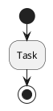

# PlantUML Normalizer

## Overview

The PlantUML Normalizer is the first pass of our two-pass parser architecture. It transforms ambiguous PlantUML syntax into an unambiguous, normalized form that can be parsed with a simple, conflict-free grammar.

## Architecture

```
Raw PlantUML → [Normalizer] → Normalized PlantUML → [Tree-sitter Parser] → AST
   (Pass 1)                                              (Pass 2)
```

### Why Normalization?

PlantUML syntax has several ambiguities that make direct parsing difficult:

1. **Circle Node Ambiguity**: `(*)` can mean start OR stop
2. **Implicit Syntax**: Many shorthands and optional keywords
3. **Context-Dependent Tokens**: Same syntax means different things in different contexts
4. **Whitespace Flexibility**: Inconsistent spacing rules

The normalizer resolves ALL these ambiguities before parsing, allowing the grammar to be simple and maintainable.

## Transformation Rules

### Rule 1: Circle Node Resolution

**Problem**: `(*)` is ambiguous - it could be start or stop.

**Solution**: Convert to explicit keywords based on context.

```plantuml
@startuml
(*)            ← First occurrence = START
:Task;
(*)            ← After activity = STOP
@enduml
```

**Normalized**:


**Algorithm**:
- First `(*)` in diagram → `start`
- Subsequent `(*)` after content → `stop`
- Context tracked via `hasSeenContent` flag

### Rule 2: Activity Node Normalization

**Problem**: Inconsistent spacing around `:` and `;`

**Solution**: Standardize format to `:label;`

**Before**:
```plantuml
: Task with spaces ;
:Another task  ;
:   Indented   ;
```

**After**:
```plantuml
:Task with spaces;
:Another task;
:Indented;
```

### Rule 3: Arrow Normalization

**Problem**: Various arrow styles with inconsistent spacing

**Solution**: Standardize spacing: `source -> target` or `-> :label`

**Before**:
```plantuml
->  :  Label
-->   :Next
A  ->  B
```

**After**:
```plantuml
-> :Label
--> :Next
A -> B
```

**Supported Arrow Types**:
- `->` - Solid arrow
- `-->` - Dashed arrow
- `->>` - Thick arrow
- `.>` - Dotted arrow
- `<-`, `<--`, `<<-`, `<.` - Left-pointing variants

### Rule 4: Control Flow Normalization

#### If-Then-Else

**Before**:
```plantuml
if ( condition ) then ( yes )
  :Task;
else ( no )
  :Other;
endif
```

**After**:
```plantuml
if (condition) then (yes)
  :Task;
else (no)
  :Other;
endif
```

#### While Loops

**Before**:
```plantuml
while ( more? ) is ( yes )
  :Process;
endwhile ( done )
```

**After**:
```plantuml
while (more?) is (yes)
  :Process;
endwhile (done)
```

### Rule 5: Grouping Normalization

#### Partitions

**Before**:
```plantuml
partition Phase 1 #LightBlue {
  :Task;
}
partition 'Phase 2' {
  :Task;
}
```

**After**:
```plantuml
partition "Phase 1" #LightBlue {
  :Task;
}
partition "Phase 2" {
  :Task;
}
```

**Changes**:
- All partition names wrapped in double quotes
- Color specifications standardized
- Consistent brace placement

#### Swimlanes

**Before**:
```plantuml
|  Name  |
```

**After**:
```plantuml
|Name|
```

### Rule 6: Note Normalization

**Single-line notes**:
```plantuml
note left: Important info
```
(No change - already normalized)

**Multi-line notes**:
```plantuml
note left
  Line 1
  Line 2
end note
```
(Preserves content as-is)

### Rule 7: Directive Normalization

**Before**:
```plantuml
title    My Diagram
skinparam  backgroundColor   #FFFFFF
```

**After**:
```plantuml
title My Diagram
skinparam backgroundColor #FFFFFF
```

## API

### Constructor

```javascript
const normalizer = new PlantUMLNormalizer(options);
```

**Options**:
- `debug` (boolean): Enable debug logging - default: `false`
- `preserveComments` (boolean): Keep comments in output - default: `true`
- `preserveWhitespace` (boolean): Maintain original indentation - default: `false`

### Methods

#### normalize(source)

Normalize PlantUML source code.

```javascript
const result = normalizer.normalize(source);
```

**Returns**:
```javascript
{
  normalized: string,    // Normalized PlantUML
  metadata: {
    diagramType: string, // 'activity', 'sequence', etc.
    nodeCount: number,    // Number of nodes processed
    hasCircleNodes: boolean,
    circleNodeCount: number
  }
}
```

## Usage Examples

### Basic Usage

```javascript
const PlantUMLNormalizer = require('tree-sitter-plantuml/normalizer');

const normalizer = new PlantUMLNormalizer();

const source = `@startuml
(*)
:Task;
(*)
@enduml`;

const result = normalizer.normalize(source);

console.log(result.normalized);
// Output:
// @startuml
// start
// :Task;
// stop
// @enduml

console.log(result.metadata);
// { diagramType: 'activity', nodeCount: 3, hasCircleNodes: true, circleNodeCount: 2 }
```

### With Options

```javascript
const normalizer = new PlantUMLNormalizer({
  debug: true,
  preserveComments: false,
  preserveWhitespace: true
});

const result = normalizer.normalize(source);
```

### Integration with Parser

The normalizer is automatically used by PlantUMLParser:

```javascript
const PlantUMLParser = require('./index');

const parser = new PlantUMLParser();
const result = parser.parse(source);

// result.tree - parsed AST
// result.normalized - normalized source
// result.metadata - normalization metadata
```

## Context Tracking

The normalizer maintains state as it processes:

```javascript
context = {
  hasSeenContent: false,    // Any activity/control seen?
  inDiagram: false,         // Inside @startuml/@enduml?
  lastNodeType: null,       // Last node type seen
  nodeCount: 0,             // Total nodes processed
  circleNodePositions: [],  // Positions of (*) nodes
  inFloatingNote: false,    // Inside multi-line note?
  inPartition: 0,           // Partition nesting depth
  inFork: false,            // Inside fork block?
  inSplit: false            // Inside split block?
}
```

Context is reset between normalizations to ensure independence.

## Post-Processing

After line-by-line normalization, a post-processing pass refines ambiguous cases:

1. **Multiple Stop Nodes**: Verify which should remain as `stop`
2. **Junction Points**: Handle complex control flow merges
3. **Unclosed Structures**: Detect and handle incomplete blocks

## Performance

Normalization is designed to be fast:

- **Single-pass** line processing
- **Minimal lookahead** (only for diagram type detection)
- **Regex-based** pattern matching
- **Typical speed**: <10ms for diagrams under 100 lines

## Extending the Normalizer

To add new transformation rules:

1. Add rule method to normalizer class:
```javascript
normalizeMyFeature(line, trimmed) {
  if (trimmed.startsWith('myfeature')) {
    // Transform logic
    return transformedLine;
  }
  return line;
}
```

2. Add rule to `normalizeLine`:
```javascript
const myResult = this.normalizeMyFeature(normalized, trimmed);
if (myResult !== normalized) {
  return myResult;
}
```

3. Add tests in `test/normalizer/`:
```javascript
describe('My Feature Normalization', () => {
  test('normalizes my feature', () => {
    // Test cases
  });
});
```

## Testing

Run normalizer tests:

```bash
npm run test:normalizer
```

With coverage:

```bash
npm run test:normalizer -- --coverage
```

## Debugging

Enable debug mode to see transformation details:

```javascript
const normalizer = new PlantUMLNormalizer({ debug: true });
normalizer.normalize(source);

// Console output:
// [PlantUMLNormalizer] Processing line 1: @startuml
// [PlantUMLNormalizer] Found diagram start
// [PlantUMLNormalizer] Processing line 2: (*)
// [PlantUMLNormalizer] Transforming circle node to: start
// ...
```

## Troubleshooting

### Issue: Normalization changes diagram meaning

**Solution**: Check if PlantUML syntax is valid. The normalizer assumes valid input.

### Issue: Performance slow on large files

**Solution**: Process diagrams individually if file contains multiple diagrams.

### Issue: Comments stripped unexpectedly

**Solution**: Ensure `preserveComments: true` option is set.

## Future Enhancements

Planned improvements:

1. **Sequence Diagram Support**: Add rules for sequence-specific syntax
2. **Class Diagram Support**: Handle class relationships
3. **State Diagram Support**: Normalize state transitions
4. **Incremental Normalization**: Only normalize changed regions
5. **Error Recovery**: Better handling of malformed input

## Contributing

When adding normalization rules:

1. Document the ambiguity being resolved
2. Provide before/after examples
3. Add comprehensive test cases
4. Update this documentation
5. Consider edge cases

## See Also

- [MIGRATION.md](./MIGRATION.md) - Migrating from old architecture
- [README.md](../README.md) - Project overview
- [Architecture Documentation](../specification/architecture/) - Detailed design
